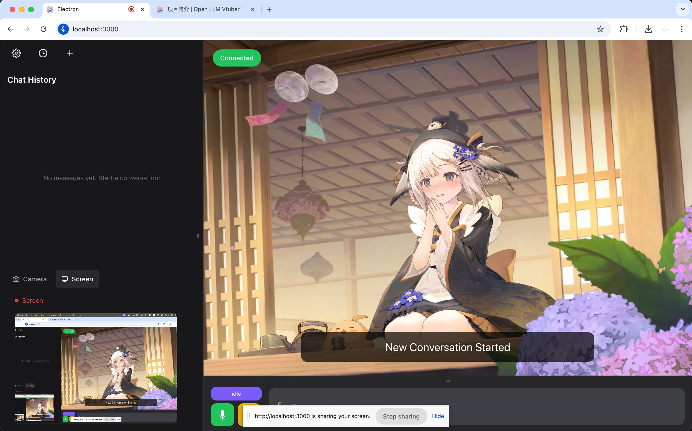

# Morgana: A Voice-Interactive AI Agent System


<h1 align="center">Morgana</h1>
<h3 align="center">A Voice-Interactive AI Agent System</h3>

## 1. Overview

Morgana is a sophisticated, voice-first AI assistant that combines a powerful multi-agent backend with an expressive, animated frontend. It is designed to provide a seamless, real-time conversational experience, capable of handling a wide array of tasks—from deep research and data analysis to managing your daily productivity and even chatting about sports.

The system features a friendly, interactive VTuber interface, allowing you to speak with Morgana naturally. Behind the scenes, a team of specialized AI agents works together to understand your requests and execute them with precision.

|                                       |                                         |
| :-----------------------------------: | :-------------------------------------: |
|  |  |
|      |       |

## 2. Core Features

-   **Real-Time Voice Conversation**: Engage in natural, full-duplex voice conversations with low latency, powered by LiveKit.
-   **Interactive Live2D Avatar**: A visually expressive and customizable VTuber character brings the AI to life.
-   **Multi-Agent Architecture**: A backend powered by LangGraph orchestrates a team of specialized agents to handle diverse tasks.
-   **Specialized Agent Capabilities**:
    -   **Deep Research**: Conducts in-depth analysis and browses the web for complex queries.
    -   **Sports Analysis**: Provides real-time data and statistics for NBA and Soccer.
    -   **Productivity Assistance**: Manages emails, calendars, and files through Microsoft Graph API integration.
-   **Extensive Toolset**: Equipped with a vast array of tools, including:
    -   Web Search (Tavily)
    -   Flight and Hotel Booking (Google Flights, Booking.com, Airbnb)
    -   Location Services (Google Maps)
    -   Event Information (Ticketmaster)
    -   Communication (WhatsApp)
-   **Cross-Platform & Offline Support**: Runs on Windows, macOS, and Linux, with the ability to function completely offline using local models.
-   **High Customizability**: Easily configure the AI's persona, voice, appearance, and the specific models (LLM, ASR, TTS) it uses.

## 3. System Architecture

Morgana is built on a decoupled architecture, with a frontend for user interaction and a backend for intelligence and task execution.

### Frontend: The VTuber Interface (`Open-LLM-VTuber/`)

This is the face of Morgana. It's a highly interactive and customizable application that:
-   Captures your voice and streams it to the backend.
-   Renders the Live2D avatar, complete with animations and expressions.
-   Displays conversation history and other visual feedback.
-   Supports both a web interface and a desktop client with a "pet mode" that can overlay on your screen.

### Backend: The Agent Brain (`backend/`)

The backend is where the core logic resides. It's a Python-based system composed of two main layers:

1.  **Voice Layer (`livekit/`)**: Built with LiveKit, this layer manages the real-time streaming of audio between the frontend and the backend, ensuring a smooth, conversational flow. It handles voice activity detection (VAD), speech-to-text (STT), and text-to-speech (TTS).

2.  **Agent Orchestration (`langgraph/`)**: This is the heart of the system, powered by LangGraph. It manages a "swarm" of specialized AI agents, routing user requests to the agent best equipped for the job.

## 4. The Agent Team

Morgana's intelligence is distributed across a team of agents, each with a specific role. A central coordinator, the **Swarm**, intelligently routes tasks to the appropriate agent.

### The Deep Researcher (`deepagents`)
For complex questions that require in-depth analysis, this agent is deployed. It has the ability to browse the web to gather information, ensuring comprehensive and well-researched answers.

### The Sports Analyst (`sportsagent`)
Your go-to expert for sports. This agent is equipped with dedicated MCP (Model Context Protocol) servers for:
-   **NBA**: Accesses live game data, player stats, and team information.
-   **Soccer**: Provides data on leagues, teams, players, and live matches from around the world.

### The Productivity Assistant (`toolsagent`)
Designed to help you manage your digital life. This agent has two key components:
-   **Microsoft MCP Server**: Integrates with the Microsoft Graph API to manage your Outlook calendar, send emails, and organize OneDrive files.
-   **General Tools**: A vast collection of utilities for tasks related to flights, hotels, maps, and more.

### The Quick Responder (`smolagent`)
For simple, everyday questions, this lightweight agent provides fast and efficient answers using a basic set of tools, like web search.

## 5. Getting Started

To get Morgana up and running, you will need to set up both the backend and the frontend.

### Prerequisites
-   Python 3.12+
-   Node.js and Yarn
-   Docker and Docker Compose

### Backend Setup (`backend/`)

1.  **Navigate to the backend directory:**
    ```bash
    cd backend
    ```
2.  **Install Python dependencies:**
    ```bash
    uv sync
    ```
3.  **Set up environment variables:**
    -   Copy `.env.example` to `.env`.
    -   Fill in your API keys for services like OpenAI, Deepgram, and LiveKit.
4.  **Run the local LiveKit and LangGraph servers:**
    ```bash
    docker compose up -d
    make dev
    ```

### Frontend Setup (`Open-LLM-VTuber/`)

1.  **Navigate to the frontend directory:**
    ```bash
    cd Open-LLM-VTuber
    ```
2.  **Install dependencies:**
    ```bash
    yarn install
    ```
3.  **Configure the application:**
    -   Copy `config_templates/conf.default.yaml` to the root of the `Open-LLM-VTuber` directory and rename it to `conf.yaml`.
    -   Edit `conf.yaml` to set up your desired LLM, TTS, and ASR models.
4.  **Run the frontend server:**
    ```bash
    python run_server.py
    ```
Once both servers are running, you can open your browser to the frontend's address (typically `http://localhost:8080`) to start interacting with Morgana.

## 6. License and Acknowledgements

This project is built upon the foundations of two incredible open-source projects:
-   [Open-LLM-VTuber](https://github.com/t41372/Open-LLM-VTuber)
-   [LangGraph Voice Call Agent](https://github.com/ahmad2b/langgraph-voice-call-agent)

The combined project is distributed under the MIT License. See the `LICENSE` files in the respective subdirectories for more details.